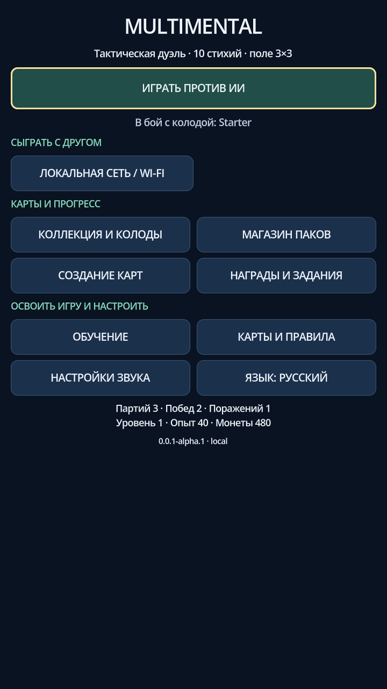
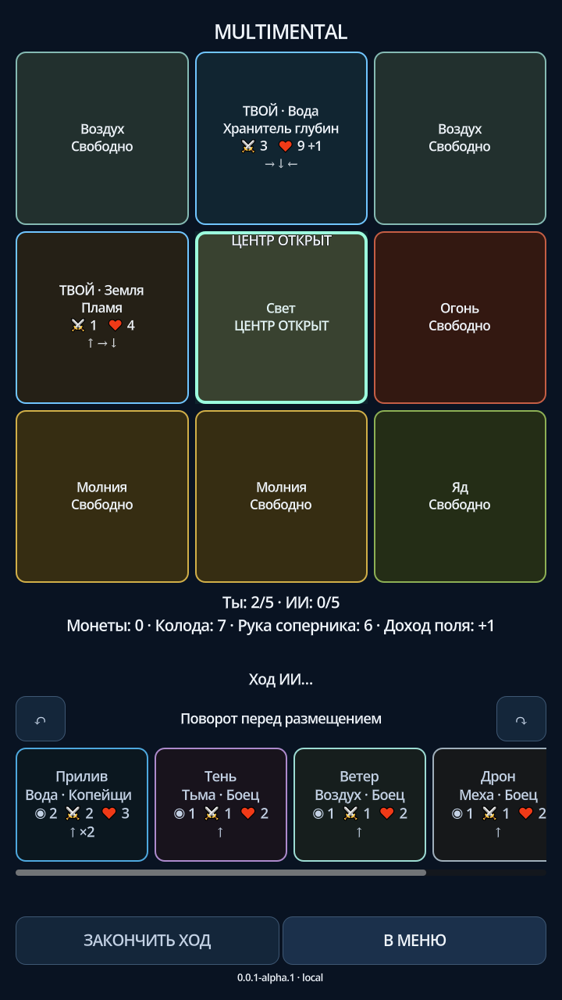

# Multimental

Тактическая карточная дуэль: поле3×3, 30карт/10стихий, свободные колоды, офлайн и локальные матчи. Android первым, рабочая интеграционная ветка **dev**.

## Продолжение
AGENTS.md → skills/game-production/SKILL.md → `scripts/chat.cmd focus`. Основная память — Issue29 и задачи. Новый срез: `collab start TASK UNIQUE_ALIAS`, перейти в выданный каталог. Цикл: focus → apply → ship. Подробности: docs/production/SHORT_COMMANDS.ru.md.

Только neurofoxpro/multimental и VENEL-SENDRIK. Не перенастраивать Git/ADB, не трогать чужие деревья, телефонные данные и постоянную подпись. Main/stable/Play требуют отдельного согласия.

## Системы
Детерминированный бой, поворот/добровольная атака, первый удар и ответы выживших, клетки/доход; профиль, коллекция/редактор, выбранные сетевые колоды, магазин, крафт, локальные награды/добровольные задания/уровни. Открытая коллекция30×2 не требует гринда. Экономика — версионная тестовая политика, не окончательный рейтинг.

Это не утверждение о завершении всей игры. Особая авторская система, финальный баланс, два физических Android, Web/server/store gates проверяются по своим Issues.

## Проверки
check — полный прогон; profile-test list — целевые наборы; device-status — фактическая установка; device-suite — отдельный аппаратный результат. Код/CI/релиз/установка/человек — разные стадии.

Документы: docs/ROADMAP.ru.md, CHANGELOG.ru.md, docs/MANUAL_TESTS.ru.md, docs/production/REWARDS_PROGRESS.ru.md, docs/production/evidence. Старый подробный skill сохранён в skills/game-production/REFERENCE.md; не требуется загружать его целиком перед каждой правкой.

<!-- gameprod:gallery:start -->
## Актуальные экраны

[Галерея 24 реальных состояний RU/EN](docs/SCREENSHOTS.ru.md) · [проверяемый манифест](docs/media/gallery/current.json). Это source-preview из изолированного профиля, не снимки установленного APK.

  
<!-- gameprod:gallery:end -->

Очередь: `work plan --tag beta`; новый изолированный срез: `work next UNIQUE_ALIAS --tag kind:automation`. Исследование: `study packet TASK` → `study run TASK` → анализ агента → `study record TASK RESULT.json`. Короткий релизный цикл: `focus` → `apply` → `ship`.
