# Multimental — актуальная галерея интерфейса

Это настоящая отрисовка исходного приложения в изолированном тестовом профиле, не нарисованные макеты и не фотографии установленного Android APK.

Снято: 2026-09-26T19:22:41.783Z. Базовый commit: 700247eea69b5d13c3463f0d0979f8feacd718cb. Ключ точных входов отрисовки: 486ce3106d120602bc59fd1aac54e810e62aac1b76fc9ad7ad2b2a6358178cbb. Изменения в рабочем дереве при съёмке: были; их точные хеши перечислены в манифесте.

Проверка: `scripts/chat.cmd gallery check`. Обновление: `scripts/chat.cmd gallery capture`, затем обычный `ship`. Манифест: [current.json](media/gallery/current.json).

Размеры здесь — логические viewport и пиксели PNG, не измеренные Android dp. CI меняет служебный build stamp; он исключён из ключа визуального кода и отдельно записан как реально показанный. Снимки сохраняют отрисованную служебную подпись, а не выдают её за установленный релиз.

Данные демонстрационные: открытая alpha-коллекция, один пак, три результата матча API-фикстуры. Для LAN подставлен адрес документационного примера; подключение не запускалось. Скриншоты не содержат рабочего стола, телефонных идентификаторов или личного профиля.

## Главное меню

| Русский · 720×1280 | English · 720×1280 |
|---|---|
|  | 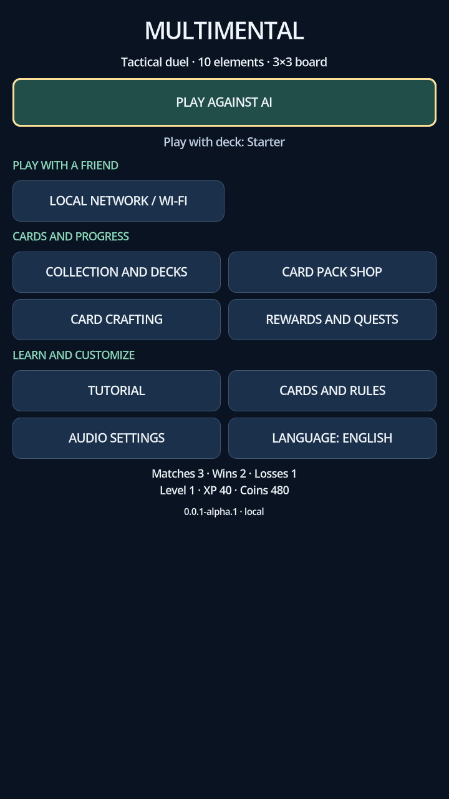 |

## Коллекция и колоды

| Русский · 720×1280 | English · 720×1280 |
|---|---|
|  | 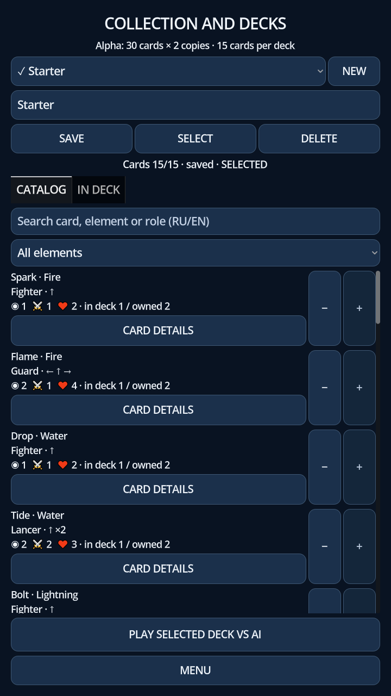 |

## Подробности карты

| Русский · 720×1280 | English · 720×1280 |
|---|---|
| 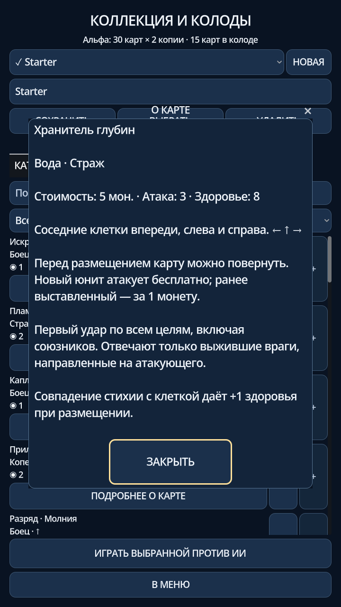 |  |

## Тактический бой

| Русский · 720×1280 | English · 720×1280 |
|---|---|
|  |  |

## Магазин паков

| Русский · 720×1280 | English · 720×1280 |
|---|---|
|  | 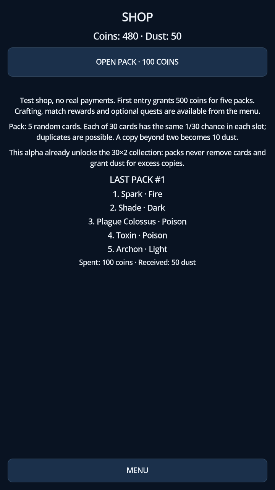 |

## Создание карт

| Русский · 720×1280 | English · 720×1280 |
|---|---|
|  |  |

## Награды и задания

| Русский · 720×1280 | English · 720×1280 |
|---|---|
|  |  |

## Подключение по LAN

| Русский · 720×1280 | English · 720×1280 |
|---|---|
| 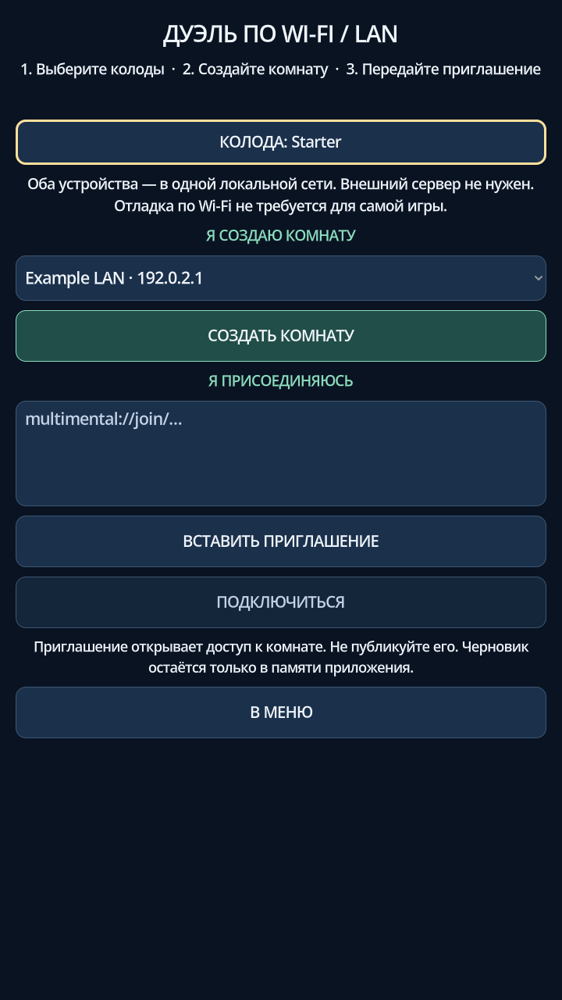 |  |

## Карты и правила

| Русский · 720×1280 | English · 720×1280 |
|---|---|
|  | 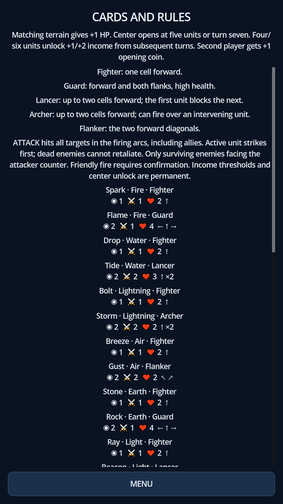 |

## Звук

| Русский · 720×1280 | English · 720×1280 |
|---|---|
| 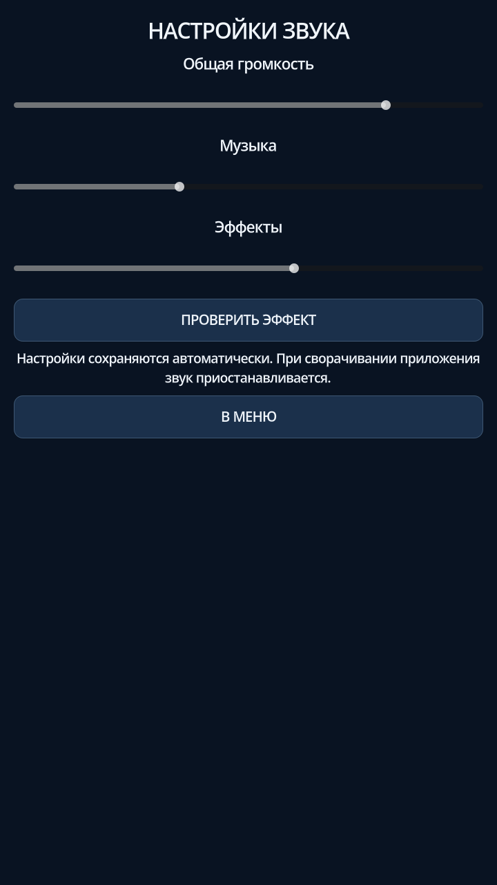 | 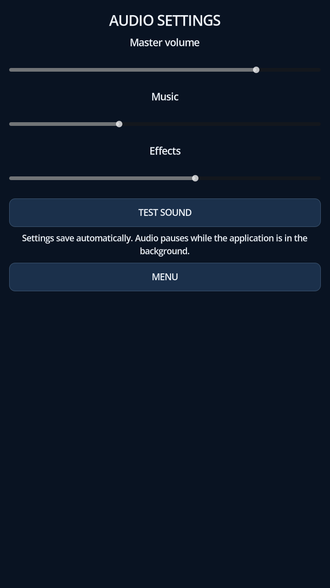 |

## Альбомные контрольные виды · 1280×720

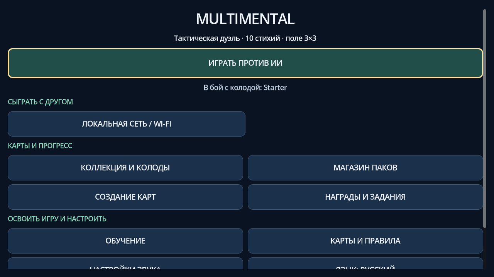

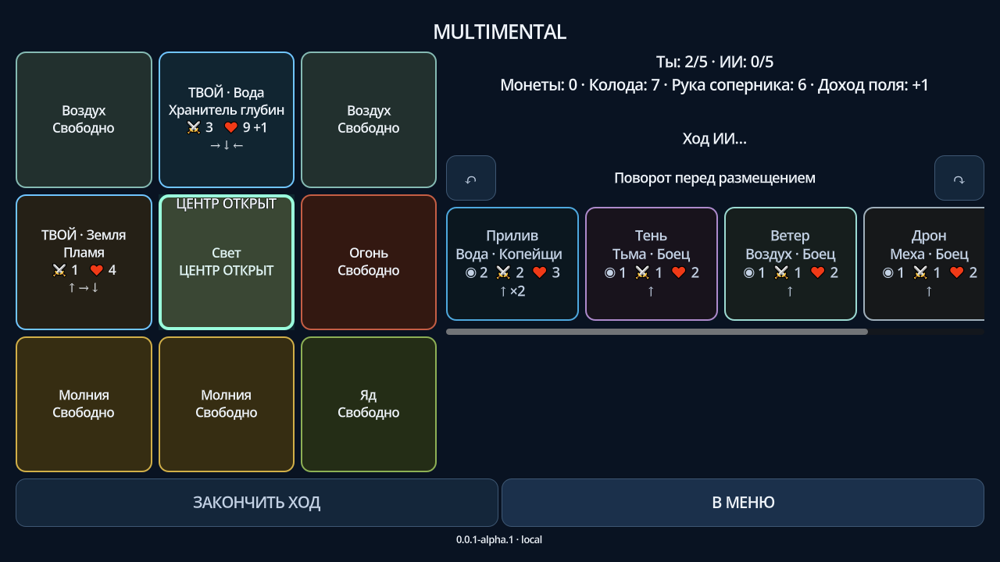

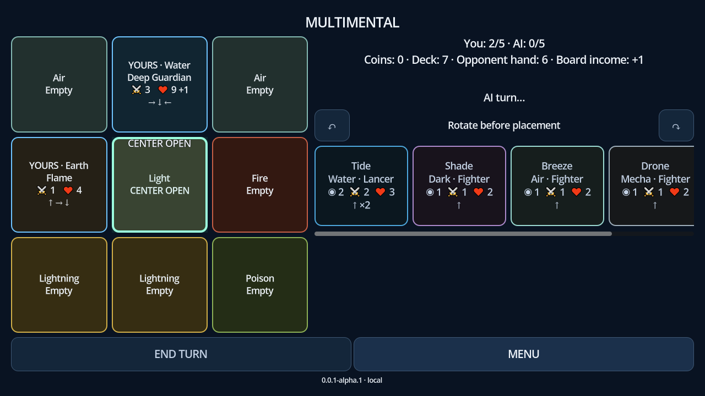

Галерея фиксирует и недостатки текущей версии. Наличие картинки не означает удобство, доступность для скринридера, исправленную навигацию или аппаратную приёмку.
